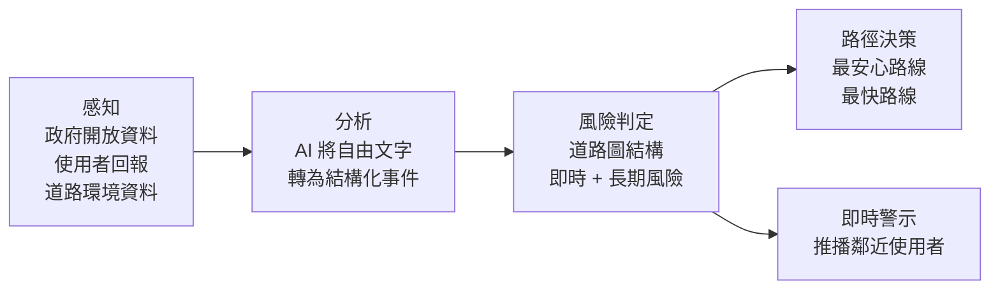

# SafeRoute

**智慧道路風險分析與安全路徑推薦系統**
An AI-driven road risk analysis and safe routing system.

SafeRoute 將分散於政府開放資料、使用者回報與道路環境中的公共安全資訊，轉換為路段層級的風險值，並直接納入路徑規劃計算。現有導航服務只回答「如何最快抵達」，SafeRoute 同時回答「哪一條路相對安全」。

> ⚠️ 本專案目前處於**原型開發階段**（prototype），尚未上架或商品化。

---

## 競賽資訊

| 項目 | 內容 |
|---|---|
| 競賽 | 大專校院資訊應用服務創新競賽 |
| 組別 | 指定專題類－產業 AI 創新組 |
| 對應主題 | 主題三　智慧運輸：以 AI 分析交通數據，提供最佳路徑規劃 |

---

## 問題與解法

當道路上發生治安事件、環境異常或其他公共安全問題時，使用者通常只能透過新聞、社群或現場目擊得知。從事件發生到民眾知悉常以數小時計，而一次夜間步行的風險暴露窗口僅有數十分鐘——「危險已經發生」與「使用者才得知」之間存在結構性的時間落差。

SafeRoute 以四個階段處理這個落差：



**感知**　整合政府開放資料、使用者不具名回報與道路環境資料。使用者僅需選擇事件類型與情境標籤即可回報，並可補充自由文字。

**分析**　以生成式 AI 與自然語言處理，將非結構化文字轉換為帶有事件類型、嚴重度、位置範圍、時效與可信度的結構化事件，並執行內容一致性檢查。若無此層，回報門檻與資料品質只能二擇一。

**風險判定**　不以行政區或固定網格判斷，而是將道路建構為圖結構（路口為節點、路段為邊），使風險精確對應至實際通行路段；同時計算即時事件風險與歷史長期基準風險。

**路徑決策**　風險值作為路徑權重進入計算，同時輸出「最安心路線」與「最快路線」供比較。

---

## 技術架構

| 層級 | 技術 | 用途 | 開源 |
|---|---|---|---|
| 前端 | Flutter | iOS／Android 雙平台介面 | ✅ |
| 地圖 | OpenStreetMap + MapLibre GL | 圖資、地圖渲染與風險圖層疊加 | ✅ |
| 後端 | Python + FastAPI | API 服務與風險引擎運算 | ✅ |
| 資料庫 | PostgreSQL + PostGIS | 道路圖結構儲存與地理空間運算 | ✅ |
| 雲端服務 | Firebase | 帳號、推播與即時同步 | ❌ |
| AI 處理 | 大型語言模型（生成式 AI／NLP） | 回報文字結構化與可信度一致性檢查 | 規劃中轉為開源模型 |

地圖端刻意不使用 Google 地圖服務，以避免衍生資料的授權限制，並確保能自由疊加自建的風險圖層。

---

## 本 repo 的開源範圍

為兼顧開源精神與智慧財產保護，本 repo 公開系統架構與資料處理層，**風險引擎的核心參數暫未公開**。

**已公開**

- 道路圖結構建立與匯入程式
- 政府開放資料的下載與清理腳本
- 資料輸入轉接層（adapter）架構
- API 介面定義與系統架構文件
- Flutter 前端介面
- 單元測試（pytest，不依賴資料庫）

**暫未公開**

- 風險權重係數與時效衰減參數
- 佐證門檻的具體數值
- AI 事件解析的提示詞內容

這些屬於本團隊仍在調校中的核心方法，待技術細節穩定並完成智慧財產評估後再行評估公開時點。

---

## 資料來源

- 政府資料開放平臺「婦幼安全警示地點」
- 各縣市政府路燈位置開放資料
- 內政部警政署公開案件統計

初期以符合官方統計特性的模擬資料驗證系統運作，所有展示中的模擬資料均明確標示。

---

## 隱私與責任設計

- 回報不向其他使用者揭露身分；後端保留的帳號連結於 90 天後解除
- 事件描述以系統改寫版本呈現，不輸出足以指認特定個人或商家的特徵
- 風險標記僅綁定路段與公共設施，不指向私人營業場所
- 單筆回報不改變顯示等級，需達獨立回報佐證門檻才升級
- 所有標記均附時效並自動衰減退場
- 本系統提供的是統計基礎的路線建議，不構成安全保證

AI 推論現階段以商用 API 驗證流程，下一階段將改採開源模型自建部署，使使用者的回報內容不離開自有伺服器。

---

## 環境需求

- Python 3.11+
- PostgreSQL 15+ 與 PostGIS 3.3+
- Flutter 3.x

```bash
# 建立設定檔（必要）
cp config.example.py config.py

# 安裝相依套件
pip install -r requirements.txt

# 環境變數（請參考 .env.example 建立自己的 .env）
cp .env.example .env
```

> 🔑 本 repo 不包含任何 API 金鑰或憑證。請自行建立 `.env`，該檔案已列入 `.gitignore`。

---

## 測試

```bash
cp config.example.py config.py          # 建立設定檔
pip install -r requirements-dev.txt     # 安裝測試相依套件
pytest
```

測試不依賴資料庫，使用合成路網與固定輸入，所有門檻與係數皆由
`config.py` 讀取。`config.example.py` 提供可直接執行的預設值；
實際校準參數未隨 repo 公開。

---

## 授權

本專案採用 MIT License，詳見 [LICENSE](LICENSE)。
